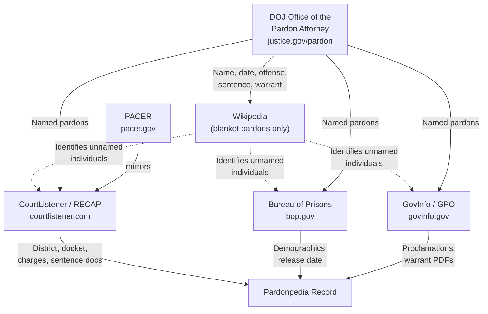

# Methodology

## 1. Purpose

Pardonpedia is a reference database of U.S. presidential clemency. Each data element displayed on the site is traceable to a named source, preserved against link loss from government website reorganizations, content takedowns, and administration changes, and labeled by source type so readers can assess its reliability. This document describes where data comes from, how records are linked across systems, what is known to be missing or imconsistent, and how the project handles these issues.

The intended audience includes journalists, researchers, policy analysts, attorneys and the public. 

---

## 2. Data Source Diagram

The DOJ Office of the Pardon Attorney is the primary source that identifies clemency recipients. For blanket pardons where individuals are not named, Wikipedia is used to identify recipients. Once a pardonee is identified, dependent government sources are queried for additional record details.

---

## 3. Source Hierarchy

Pardonpedia distinguishes between **primary** and **contextual** sources. This distinction is displayed on every pardonee page.

| Tier | Type | Examples | Label on site |
|------|------|----------|---------------|
| 1 | U.S. Government — clemency records | DOJ Office of the Pardon Attorney, GovInfo/GPO | *Primary — Government* |
| 2 | U.S. Government — court and prison records | CourtListener/RECAP (mirrors PACER), Bureau of Prisons | *Primary — Government* |
| 3 | Secondary — reference | Wikipedia | *Contextual — Reference* |
| 4 | Secondary — press | News articles | *Contextual — Press* |

Secondary sources are used where primary sources are silent — most often to identify individuals named in blanket pardons or commutations where the official document does not list recipients by name. Also, there can be a gap between when a pardon is issued and when it appears on the Justice website. In these cases, the secondary source is cited. Secondary sources are also used to provide additional context - e.g. press coverage.

---

## 4. Primary Sources

### 4.1 DOJ Office of the Pardon Attorney

**URL:** [justice.gov/pardon/clemency-recipients](https://www.justice.gov/pardon/clemency-recipients)  
**Archive:** Wayback Machine (archived at ingestion)

The Justice Departemnt - Office of the Pardon Attorney (OPA) - maintains the canonical federal clemency record. For most pardons and commutations, the OPA list is the originating source for:

- Full name of recipient
- Date of clemency action
- Offense description
- Original sentence
- Link to underlying warrant document (where available)

**Known gaps and limitations:**

- The Justice department only includes pardon and clemency information for President Nixon and subsequent administrations. Pardonpedia does not include information about pardons prior to Nixon. 
- Blanket pardons and group commutations (e.g., January 6 defendants, certain drug sentence commutations) are recorded as a class action on the justice, records. Individual names within those groups are sourced separately — see Section 5.
- Justice data is updated periodically, not in real time. There is typically a lag between a presidential action and its appearance on the Justice website.
- Pre-1980 records are less complete. Offense descriptions become more standardized in later administrations.
- The OPA website has been reorganized or partially removed during administration transitions. Pardonpedia archives all OPA pages via the Wayback Machine at the time of data ingestion. GovInfo (Section 3.2) is used as the authoritative backup for presidential documents.

---

### 4.2 GovInfo / Government Publishing Office

**URL:** [govinfo.gov](https://www.govinfo.gov)  
**Archive:** Wayback Machine (page); DocumentCloud (PDFs)

GovInfo is the U.S. Government Publishing Office's permanent repository for presidential documents, including clemency proclamations, executive grants, and warrant documents. Unlike whitehouse.gov — which is rebuilt with each new administration, often causing prior-administration content to disappear — GovInfo preserves documents across administrations as a matter of statutory obligation.

Pardonpedia uses GovInfo as the **preferred source for presidential proclamations**, superseding whitehouse.gov links where both exist. GovInfo documents are archived to DocumentCloud at ingestion for a second layer of redundancy.

Data elements supplied:

- Full text of presidential proclamations
- Official document identifiers
- Date of presidential action

---

### 4.3 CourtListener / RECAP Archive

**URL:** [courtlistener.com](https://www.courtlistener.com) | [Free Law Project](https://free.law)  
**Archive:** Self-archiving (RECAP stores documents permanently)

CourtListener, operated by the nonprofit Free Law Project, is a free public mirror of PACER (Public Access to Court Electronic Records), the federal judiciary's official document system. Because it is easier to use and search than PACER, it is used here, but the original source documents in PACER are always available via links within CourtListener.

Pardonpedia uses CourtListener **to retrieve documents, not to discover pardons**: the project starts from pardonees found on Justice.gov and in presidential press releases, and locates their federal court records, rather than searching court records to identify pardonees.

Data elements supplied:

- Federal district and division
- Case docket number
- Charge(s) and statute(s) of conviction
- Sentencing documents (including guidelines calculations where filed)
- Fines, forfeitures, and restitution ordered
- Sentencing judge quotes and judicial findings
- Case timeline (arrest, indictment, conviction, sentencing dates)

**Matching methodology:** Records are linked from Pardonpedia pardonee profiles to CourtListener dockets using a combination of: full name, conviction year, offense type, and federal district. Matches are assigned a confidence score. Low-confidence matches are flagged for human review and are not displayed on the site until confirmed. See Section 6 for detail.

**Known gaps:**

- Pre-electronic-filing cases (generally pre-1996 in most districts) have no RECAP coverage. Paper dockets exist in PACER but were not systematically digitized.
- Some documents remain sealed or restricted in PACER and are therefore absent from RECAP.
- Preemptive pardons (granted before any indictment or conviction) have no corresponding court record by definition. These are flagged in the database with a `preemptive` indicator rather than left as missing data.

**Relationship to PACER:** CourtListener mirrors PACER content contributed by users of the RECAP browser extension. Coverage is not 100% — high-profile cases tend to have better coverage because they attract more RECAP uploads. Pardonpedia supplements CourtListener with direct PACER retrieval for confirmed pardonees where CourtListener coverage is incomplete.

---

### 4.4 Bureau of Prisons (BOP)

**URL:** [bop.gov/inmateloc](https://www.bop.gov/inmateloc/)  
**Archive:** Wayback Machine (snapshots taken at data retrieval)

The Federal Bureau of Prisons inmate locator provides limited but officially sourced demographic and custody data for individuals who have been or are currently in federal custody.

Data elements supplied:

- Date of birth / age
- Race and sex (as recorded by BOP)
- Release date (actual or projected)
- Facility or release status

**Known gaps:**

- BOP records reflect custody status at the time of retrieval; post-release records are not retained in the public locator.
- Not all pardonees served federal prison time (e.g., those sentenced to probation, home confinement, or whose sentences were commuted before incarceration).
- BOP data may differ slightly from court records on offense descriptions due to internal classification systems.

---

### 4.5 PACER

**URL:** [pacer.gov](https://www.pacer.gov)  
**Role:** Supplemental retrieval for CourtListener gaps

PACER is the federal judiciary's primary public access system. Pardonpedia uses PACER selectively — for confirmed pardonees where CourtListener coverage is incomplete — rather than as a primary retrieval pipeline. Documents retrieved from PACER are uploaded to RECAP (contributing to CourtListener's coverage) and archived to DocumentCloud.

---

## 5. Secondary and Contextual Sources

Secondary sources are used to fill gaps in primary government records and to provide biographical and contextual information. They are displayed in a clearly labeled separate section on pardonee pages and are never merged with primary government data without explicit sourcing.

### 5.1 Wikipedia

**Usage:** Research and name identification only  
**License note:** Wikipedia content is licensed CC BY-SA 4.0. The ShareAlike clause is incompatible with Pardonpedia's CC BY 4.0 dataset license. Wikipedia is therefore used as a research source only — facts are independently verified and rewritten in original prose. No Wikipedia text is reproduced on the site.

Wikipedia is used primarily to identify individuals named in blanket pardons and group commutations where the underlying government document does not list recipients by name. Where Wikipedia is used as an identification source, the specific article and revision are cited.

### 5.2 Press Accounts

Press coverage is displayed in a dedicated **Press Coverage** section on pardonee pages, below the primary data and editorial summary. Each press item includes:

- Headline and publication
- Date
- A brief annotated excerpt (written by Pardonpedia editors)
- Link to original article
- Link to Wayback Machine archive (created at ingestion via Save Page Now API)

Press accounts are labeled *Contextual — Press* and are not used to populate structured data fields.

---

## 6. Archiving Policy

Link rot is a structural threat to reference databases. Pardonpedia mitigates it as follows:

| Source type | Archiving method | Timing |
|-------------|-----------------|--------|
| Government webpages (DOJ, BOP, whitehouse.gov) | Wayback Machine via Save Page Now API | At ingestion |
| GovInfo PDF documents | DocumentCloud + Wayback Machine | At ingestion |
| Press articles | Wayback Machine via Save Page Now API | At ingestion |
| PACER documents | RECAP upload + DocumentCloud | At retrieval |
| CourtListener permalinks | Stable (Free Law Project guarantees permanence) | N/A |

Every data element linked on the site carries both an original URL and an archive URL. If the original URL becomes unavailable, the archive link remains functional. GovInfo is used instead of whitehouse.gov for presidential documents because GovInfo's preservation mandate is statutory — whitehouse.gov content is routinely removed between administrations.

---

## 7. Data Linkage and Record Matching

Pardonpedia links records across multiple government systems that were not designed to interoperate. The following describes how those connections are made and where uncertainty exists.

### 7.1 Shared Identifiers

Some systems share identifiers that allow reliable automated matching:

| Systems | Shared identifier |
|---------|------------------|
| PACER ↔ CourtListener | Case docket number (district + case number) |
| BOP ↔ Court records | BOP register number (where filed in court documents) |

### 7.2 Fuzzy Matching

Where shared identifiers are absent, records are matched using a weighted combination of:

- Full name (exact and phonetic variants)
- Conviction year (±1 year tolerance)
- Offense category
- Federal district

Each match is assigned a **confidence score** (High / Medium / Low). Matches scored Medium or Low are flagged in the database and reviewed by a human editor before the linked court record is displayed on the site. Low-confidence matches that cannot be confirmed are suppressed from public display with a note that court records have not been located.

### 7.3 Structural Data Gaps

Some gaps are structural — they reflect the nature of the clemency power or the limits of public records — rather than errors in data collection. These are documented explicitly:

| Gap type | How it is handled |
|----------|------------------|
| Preemptive pardon (no underlying conviction) | `preemptive` flag; court record fields shown as N/A |
| Blanket pardon (individual not named in warrant) | Secondary source cited for name identification |
| Pre-electronic-filing era (pre-~1996) | Court record fields marked *Not available — pre-electronic filing* |
| Missing district data | Null (unknown) vs. flagged no-conviction cases are distinguished |
| BOP record absent (no prison term served) | Fields marked *Not applicable* |

---

## 8. Corrections and Feedback

Pardonpedia is committed to accuracy. If you identify an error in a data element, a broken source link, an incorrect record match, or a factual misstatement in an editorial summary, please contact us at **[contact address]**.

When reporting an error, please include:
- The pardonee name and page URL
- The specific field or statement in question
- The source you believe is correct, with a link if available

Corrections are reviewed by an editor and, where confirmed, applied to both the displayed record and the underlying database. Significant corrections are noted in the [Release Notes](#) for that page or data element.

---

*Pardonpedia is an independent nonprofit project. Primary dataset licensed [CC BY 4.0](https://creativecommons.org/licenses/by/4.0/). Editorial content all rights reserved. See [About Pardonpedia](#) for mission, funding, and team.*
