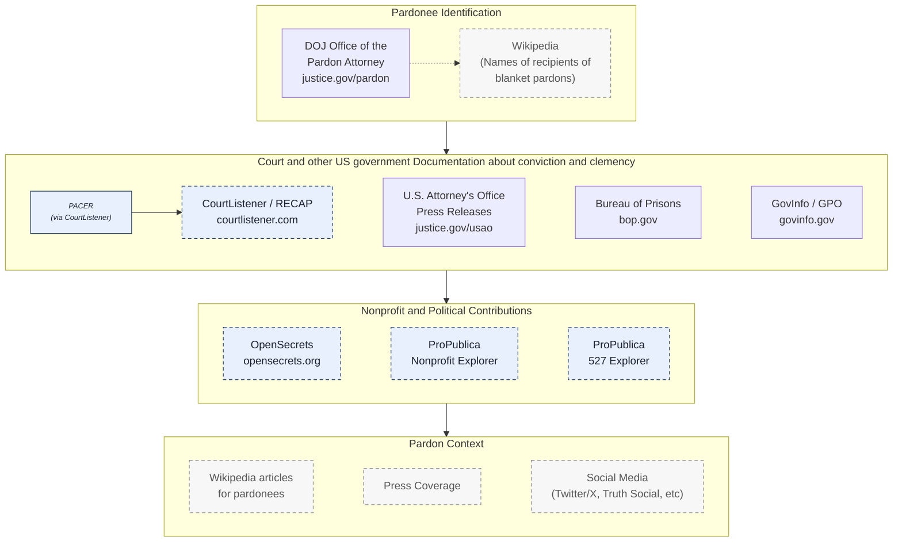

# Methodology

## 1. Purpose

Pardonpedia is a reference database of U.S. presidential clemency actions. Information on the site is traceable to a named source, preserved against link loss from government website reorganizations, content takedowns, and administration changes, and labeled so readers can assess its reliability. This document describes where information comes from, how pardons are matched across systems, what is known to be missing or inconsistent, and how the project handles these issues.

The intended audience is journalists, researchers, policy analysts, attorneys and the public. 

---

## 2. Data Sources

The DOJ Office of the Pardon Attorney is the primary source identifying clemency recipients. For blanket pardons where individuals are not named, Wikipedia is used to identify recipients. Once a pardonee is identified, details are added from government are other sources.

  U.S. Government source
  Derived from U.S. Government sources
  Contextual / non-government

---

## 3. Source Types

Sources are organized into the four functional categories shown in the diagram above. Each source is also labeled by origin — *U.S. Government*, *Derived from U.S. Government sources*, or *Contextual / non-government* — so readers can assess reliability at a glance. The origin label is displayed alongside every citation on pardonee pages.

| # | Category | Purpose | Sources | Origin |
|---|----------|---------|---------|--------|
| 1 | Pardonee Identification | Establishes who received clemency | DOJ Office of the Pardon Attorney; Wikipedia (for individuals unnamed in blanket pardons) | *U.S. Government* (DOJ); *Contextual* (Wikipedia) |
| 2 | Court and other U.S. Government documentation | Conviction, sentencing, incarceration, and clemency records | GovInfo/GPO, U.S. Attorney's Office press releases, Bureau of Prisons; CourtListener/RECAP (mirrors PACER) | *U.S. Government*; *Derived* (CourtListener) |
| 3 | Nonprofit and political contributions | Donor networks and 501(c) affiliations, derived from FEC filings and IRS Form 990 | OpenSecrets, ProPublica Nonprofit Explorer, ProPublica 527 Explorer | *Derived from U.S. Government sources* |
| 4 | Pardon context | Biographical and narrative context around a clemency action | Wikipedia articles, press coverage, official social media (Twitter/X, Truth Social, etc) | *Contextual / non-government* |

**Origin labels in practice.** *U.S. Government* sources are treated as authoritative for structured data (names, dates, offenses, sentences). *Derived* sources repackage government filings — they are citable and carry the credibility of their underlying public records, but the presenting organization's own analysis is treated as contextual. *Contextual* sources are used where primary sources are silent (most often to identify individuals affected by blanket pardons), where there is a lag between a presidential action and its appearance on the DOJ site, or to provide biographical, narrative, and public-statement context. Contextual sources are never merged with primary government data without explicit sourcing.

---

## 4. Primary Sources

### 4.1 DOJ Office of the Pardon Attorney

**URL:** [justice.gov/pardon/clemency-recipients](https://www.justice.gov/pardon/clemency-recipients)  
**Archive:** [Internet Archive](https://archive.org/) (archived at ingestion)

The Justice Departemnt - Office of the Pardon Attorney (OPA) - maintains the canonical federal clemency record. For most pardons and commutations, the OPA list is the originating source for:

- Full name of recipient
- Date of clemency action
- Offense description
- Original sentence
- District
- Link to underlying warrant document (where available)

**Known gaps and limitations:**

- The Justice department only includes pardon and clemency information for President Nixon and subsequent administrations. Pardonpedia does not include information about pardons prior to Nixon. 
- Blanket pardons and group commutations (e.g., January 6 defendants, certain drug sentence commutations) are recorded as a class action on the justice records. Individual names within those groups are sourced separately — see Section 5.
- The Department of Justice website is updated periodically, not in real time, so there will be a lag between a presidential action and its appearance on the Justice website.
- Pre-1980 records are less complete. Offense descriptions become more standardized in later administrations.
- The OPA website has been reorganized or partially removed during administration transitions. Pardonpedia archives all OPA pages via the [Internet Archive](https://archive.org/) at the time of data ingestion. GovInfo (Section 3.2) is used as the authoritative backup for presidential documents.

---

### 4.2 GovInfo / Government Publishing Office

**URL:** [govinfo.gov](https://www.govinfo.gov)  
**Archive:** [Internet Archive](https://archive.org/) (webpages); DocumentCloud (PDFs)

GovInfo is the U.S. Government Publishing Office's permanent repository for presidential documents, including clemency proclamations, executive grants, and warrant documents. Unlike whitehouse.gov — which is rebuilt with each new administration, causing prior-administration content to innaccessible — GovInfo is required by law to preserve documents across administrations.

Pardonpedia uses GovInfo as the **preferred source for presidential proclamations**, superseding whitehouse.gov links where both exist. GovInfo documents are archived to DocumentCloud at ingestion for a second layer of redundancy.

Data elements supplied:

- Full text of presidential proclamations
- Official document identifiers
- Date of presidential action

---

### 4.3 CourtListener / RECAP Archive

**URL:** [courtlistener.com](https://www.courtlistener.com) | [Free Law Project](https://free.law)  
**Archive:** Self-archiving (RECAP stores documents permanently)

CourtListener, operated by the nonprofit Free Law Project, is a free public mirror of PACER (Public Access to Court Electronic Records), the federal judiciary's official document system. Because it is easier to use and search than PACER, it is more widely used, and hence is used here. The original source documents in PACER are always available via links within CourtListener.

Note that Pardonpedia uses CourtListener **to retrieve pardon court documents, not to discover pardons**: the search for court documents starts from pardonees found on Justice.gov, presidential press releases and wikipedia (as outlined above).

Data elements supplied:

- Federal district and division
- Case docket number
- Charge(s) and statute(s) of conviction
- Sentencing documents (including guidelines calculations where filed)
- Fines, forfeitures, and restitution ordered
- Sentencing judge quotes and judicial findings
- Case timeline (arrest, indictment, conviction, sentencing dates)

**Matching methodology:** Records are linked from Pardonpedia pardonee profiles to CourtListener dockets using a combination of: full name, conviction year, offense type, and federal district. Matches are assigned a confidence score. Low-confidence matches are flagged for human review and are not displayed on the site until confirmed. See Section 6 for detail.

**Known gaps:**

- Pre-electronic-filing cases (generally pre-1996 in most districts) have no RECAP coverage. Paper dockets exist in PACER but were not systematically digitized.
- Some documents remain sealed or restricted in PACER and are therefore absent from RECAP.
- Preemptive pardons (granted before any indictment or conviction) have no corresponding court record by definition. These are flagged in the database with a `preemptive` indicator rather than left as missing data.

**Relationship to PACER:** CourtListener mirrors PACER content contributed by users of the RECAP browser extension. Coverage is not 100% — high-profile cases tend to have better coverage because they attract more RECAP uploads. Pardonpedia supplements CourtListener with direct PACER retrieval for confirmed pardonees where CourtListener coverage is incomplete.

---

### 4.4 U.S. Attorney's Office Press Releases

**URL:** [justice.gov/usao/pressreleases](https://www.justice.gov/usao/pressreleases)  
**Archive:** [Internet Archive](https://archive.org/) (archived at ingestion via Save Page Now)

U.S. Attorney's Office press releases provide official, government-authored summaries of federal criminal cases. They are used to supplement court records with a concise narrative of the case from the prosecuting office.

Data elements supplied:

- Charges and statutes
- Plea or conviction details
- Sentencing outcomes
- Restitution, forfeiture, and fines ordered
- Victim impact descriptions

**Known gaps:**

- Not every federal case receives a press release; coverage skews toward higher-profile prosecutions.
- Press release content reflects the prosecution's perspective at the time of publication and is not updated to reflect later appeals, resentencings, or pardons.
- Some older releases have been removed during USAO website reorganizations. Archived copies are retained via the Internet Archive.

---

### 4.5 Bureau of Prisons (BOP)

**URL:** [bop.gov/inmateloc](https://www.bop.gov/inmateloc/)  
**Archive:** [Internet Archive](https://archive.org/) (snapshots taken at data retrieval)

The Federal Bureau of Prisons inmate locator provides limited but officially sourced demographic and custody data for individuals who have been or are currently in federal custody.

Data elements supplied:

- Date of birth / age
- Race and sex (as recorded by BOP)
- Release date (actual or projected)
- Facility or release status

**Known gaps:**

- BOP records reflect custody status at the time of retrieval; post-release records are not retained in the public locator.
- Not all pardonees served federal prison time (e.g., those sentenced to probation, home confinement, or whose sentences were commuted before incarceration).
- BOP data may differ slightly from court records on offense descriptions due to internal classification systems.

---

### 4.6 PACER

**URL:** [pacer.gov](https://www.pacer.gov)  
**Role:** Supplemental retrieval for CourtListener gaps

PACER is the federal judiciary's primary public access system. Pardonpedia uses PACER selectively — for confirmed pardonees where CourtListener coverage is incomplete — rather than as a primary retrieval pipeline. Documents retrieved from PACER are uploaded to RECAP (contributing to CourtListener's coverage) and archived to DocumentCloud.

---

## 5. Secondary and Contextual Sources

Secondary sources are used to fill gaps in primary government records and to provide biographical and contextual information. They are displayed in a clearly labeled separate section on pardonee pages and are never merged with primary government data without explicit sourcing.

### 5.1 Wikipedia

**Usage:** Research and name identification only  

Wikipedia is used primarily to identify individuals named in blanket pardons and group commutations where the underlying government document does not list recipients by name. Where Wikipedia is used as an identification source, the specific article and revision are cited.

### 5.2 Press Accounts

Press coverage is displayed in a dedicated **Press Coverage** section on pardonee pages, below the primary data and editorial summary. Each press item includes:

- Headline and publication
- Date
- A brief annotated excerpt (written by Pardonpedia editors)
- Link to original article
- Link to [Internet Archive](https://archive.org/) archive (created at ingestion via Save Page Now API)

Press accounts are labeled *Contextual — Press* and are not used to populate structured data fields.

### 5.3 Social Media and Public Statements

**Usage:** Citation of stated rationale and announcements  
**Archive:** [Internet Archive](https://archive.org/) via Save Page Now at citation time; full-text excerpt stored locally in case of deletion

Presidents and senior officials frequently announce, preview, or explain clemency decisions on social media platforms (e.g., Twitter/X, Truth Social, etc). These posts are citable primary-voice statements for the stated rationale of a pardon, even where the official record (DOJ, GovInfo) is silent on motivation.

Social media posts are labeled *Contextual — Statement* and are displayed in a dedicated section on pardonee pages. They are never used to populate primary data fields (date of action, offense, sentence) — only to document what the issuing official publicly said about the action.

**Known gaps and limitations:**

- Posts can be deleted, edited, or hidden after the fact. Every cited post is archived to the Internet Archive and the relevant excerpt is preserved in Pardonpedia's own store at the time of citation.
- Platform availability is uneven across administrations and accounts; coverage is incidental rather than systematic.
- Attribution is limited to verified official accounts. Posts from personal or unverified accounts are not cited.

### 5.4 OpenSecrets

**URL:** [opensecrets.org](https://www.opensecrets.org)  
**Usage:** Research and citation only

OpenSecrets, operated by the Center for Responsive Politics, builds on FEC filings and adds donor network mapping, bundler relationships, and outside spending that raw FEC data does not surface cleanly. Pardonpedia uses OpenSecrets as a research aid to establish a pardonee's donor ecosystem and to identify politically relevant relationships referenced in editorial context.

No structured financial data from OpenSecrets is ingested into Pardonpedia's database. Where OpenSecrets informs a factual statement on a pardonee page, the specific OpenSecrets page is cited inline.

### 5.5 ProPublica Nonprofit Explorer

**URL:** [projects.propublica.org/nonprofits](https://projects.propublica.org/nonprofits/)  
**Usage:** Research and citation only

Nonprofit Explorer surfaces IRS Form 990 filings, making it practical to research nonprofits and advocacy organizations that may have funded or publicly supported a clemency campaign, or that are linked to a pardonee. Pardonpedia uses it as a research aid for pardonees with documented nonprofit affiliations or organized advocacy campaigns supporting their clemency.

No structured nonprofit data is ingested into Pardonpedia's database. Where Nonprofit Explorer informs a factual statement on a pardonee page, the specific filing or organization page is cited inline.

---

## 6. Archiving Policy

Link rot is a structural threat to reference databases. Pardonpedia mitigates it as follows:

| Source type | Archiving method | Timing |
|-------------|-----------------|--------|
| Government webpages (DOJ, BOP, whitehouse.gov) | [Internet Archive](https://archive.org/) via Save Page Now API | At ingestion |
| USAO press releases | [Internet Archive](https://archive.org/) via Save Page Now API | At ingestion |
| GovInfo PDF documents | DocumentCloud + [Internet Archive](https://archive.org/) | At ingestion |
| Press articles | [Internet Archive](https://archive.org/) via Save Page Now API | At ingestion |
| PACER documents | RECAP upload + DocumentCloud | At retrieval |
| CourtListener permalinks | Stable (Free Law Project guarantees permanence) | N/A |
| Social media posts | [Internet Archive](https://archive.org/) via Save Page Now API + local excerpt | At citation |
| Third-party research pages (OpenSecrets, ProPublica Nonprofit Explorer) | [Internet Archive](https://archive.org/) via Save Page Now API | At citation |

Every data element linked on the site carries both an original URL and an archive URL. If the original URL becomes unavailable, the archive link remains functional. GovInfo is used instead of whitehouse.gov for presidential documents because GovInfo's preservation mandate is statutory — whitehouse.gov content is routinely removed between administrations.

---

## 7. Data Linkage and Record Matching

Pardonpedia links records across multiple government systems that were not designed to interoperate. The following describes how those connections are made and where uncertainty exists.

### 7.1 Shared Identifiers

Some systems share identifiers that allow reliable automated matching:

| Systems | Shared identifier |
|---------|------------------|
| PACER ↔ CourtListener | Case docket number (district + case number) |
| BOP ↔ Court records | BOP register number (where filed in court documents) |

### 7.2 Fuzzy Matching

Where shared identifiers are absent, records are matched using a weighted combination of:

- Full name (exact and phonetic variants)
- Conviction year (±1 year tolerance)
- Offense category
- Federal district

Each match is assigned a **confidence score** (High / Medium / Low). Matches scored Medium or Low are flagged in the database and reviewed by a human editor before the linked court record is displayed on the site. Low-confidence matches that cannot be confirmed are suppressed from public display with a note that court records have not been located.

### 7.3 Structural Data Gaps

Some gaps are structural — they reflect the nature of the clemency power or the limits of public records — rather than errors in data collection. These are documented explicitly:

| Gap type | How it is handled |
|----------|------------------|
| Preemptive pardon (no underlying conviction) | `preemptive` flag; court record fields shown as N/A |
| Blanket pardon (individual not named in warrant) | Secondary source cited for name identification |
| Pre-electronic-filing era (pre-~1996) | Court record fields marked *Not available — pre-electronic filing* |
| Missing district data | Null (unknown) vs. flagged no-conviction cases are distinguished |
| BOP record absent (no prison term served) | Fields marked *Not applicable* |

---

*Pardonpedia is an independent nonprofit project. Primary dataset licensed [CC BY 4.0](https://creativecommons.org/licenses/by/4.0/). Editorial content all rights reserved. See [About Pardonpedia](#) for mission, funding, and team.*
